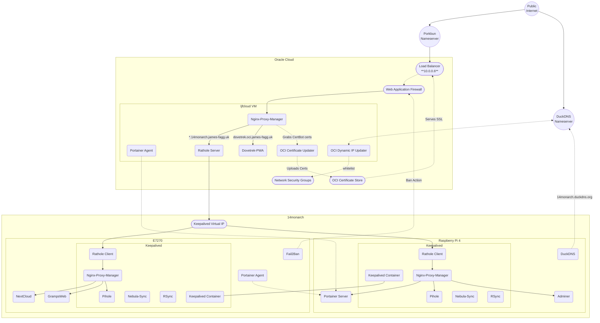

# Homelab-setup
This repo is for fully dpeloying my homelab services across multiple on-prem and cloud based machines.
On-Prem includes a Dell E7270 Laptop and a Raspberry Pi 4 8gb that are a failover pair via keepalived. 
Oracle Cloud hosts a virtual machine acting as a tunnel for on-prem hosted services, protected by the OCI Load Balancer and WAF.

The mission statement of this is to self-host paid-for cloud services in a secure manner.

The project tasklist is here: https://github.com/users/liamj-f/projects/3

## List of Services
Those in brackets are not yet fully deployed/Tested
### RPI4 & E7270 via Keepalived
- Pihole
- Nginx Proxy Manager
- Nebula-Sync
- Rsync
- Keepalived
- (Rathole-Client)

### E7270
- (Nextcloud)
- (PostGres)
- Adminer
- Portainer-Agent
- (GrampsWeb)
- (Frigate)
- Traefik/WHOAMI 

### RPI4
- Portainer
- DuckDNS
- Homepage

### LJFCloud 
- Portainer-Agent
- Nginx Proxy Manager
- Dovetrek-PWA
- DuckDNS

## Final Architecture
 

