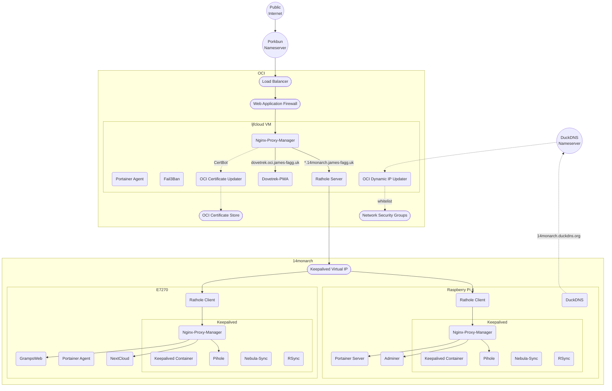

```mermaid
flowchart TB
    duck_ns((DuckDNS 
            Nameserver))
    internet((Public 
            Internet)) --> pbdns((Porkbun 
                                Nameserver))

    subgraph OCI
        direction TB
%%        lb@{ img: "https://static.oracle.com/cdn/fnd/gallery/2607.0.1/images/ico-load-balancer.svg", label: "OCI Load balancer",pos: "b", constraint: "on" }
        lb([Load Balancer])
        waf([Web Application Firewall])
        nsg([Network Security Groups])
        ocicerts([OCI Certificate Store])
        subgraph ljfvm[ljfcloud VM]
            direction LR
            portainer_a1(Portainer Agent)
            fail3ban(Fail3Ban)
            oci-ddns(OCI Dynamic IP Updater) 
            
            
            dvtrk(Dovetrek-PWA)
            oci-cert-up(OCI Certificate Updater)
            nginx3(Nginx-Proxy-Manager) --"*.14monarch.james-fagg.uk"--> rathole_s(Rathole Server)
            nginx3 --"dovetrek.oci.james-fagg.uk"--> dvtrk
        end
            lb --> waf --> nginx3
            nginx3 -."CertBot".-> oci-cert-up -.->  ocicerts

    end

    subgraph monarch14[14monarch]
        
        ka_vip([Keepalived Virtual IP])

        subgraph rpi4[Raspberry Pi 4]
            subgraph ka1[Keepalived]
                ka_c1(Keepalived Container)
                pihole1(Pihole)
                neb_s1(Nebula-Sync)
                nginx1(Nginx-Proxy-Manager)
                rsync1(RSync)
            end
            portainer_s(Portainer Server)
            rathole_c1(Rathole Client)
            adminer(Adminer)
            duckdns(DuckDNS)
            nginx1 --> pihole1 & adminer & portainer_s

        end

        subgraph e7270[E7270]
            subgraph ka2[Keepalived]
                ka_c2(Keepalived Container)
                pihole2(Pihole)
                neb_s2(Nebula-Sync)
                nginx2(Nginx-Proxy-Manager)
                rsync2(RSync)
            end
            portainer_a2(Portainer Agent)
            rathole_c2(Rathole Client)
            NxtCld(NextCloud)
            gramps(GrampsWeb)
            nginx2 --> pihole2 & NxtCld & gramps
        end

    end

    rathole_s ----> ka_vip
    ka_vip --> rathole_c1 & rathole_c2
    rathole_c1 --> nginx1
    rathole_c2 --> nginx2
    pbdns --> lb
    duck_ns ~~~~ duckdns -."14monarch.duckdns.org"-.-> duck_ns -.-> oci-ddns -."whitelist".-> nsg

 %% https://static.oracle.com/cdn/fnd/gallery/2607.0.1/images/ico-load-balancer.svg
```

