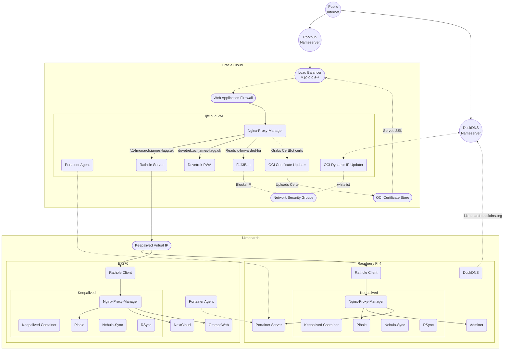

 

```mermaid
flowchart TB
classDef lan fill:#ffd6d6,stroke:#c92a2a,stroke-width:2px,color:#000

    internet((Public 
            Internet)) --> pbdns((Porkbun 
                                Nameserver)) & duck_ns((DuckDNS 
            Nameserver))

    subgraph OCI["Oracle Cloud"]
        direction TB
        %%        lb@{ img: "https://static.oracle.com/cdn/fnd/gallery/2607.0.1/images/ico-load-balancer.svg", label: "OCI Load balancer",pos: "b", constraint: "on" }
        lb([Load Balancer
                **10.0.0.6**]) 
        waf([Web Application Firewall]) ~~~
        nsg([Network Security Groups]) 
        ocicerts([OCI Certificate Store]) 

        subgraph ljfvm[ljfcloud VM]
            direction LR
            portainer_a1(Portainer Agent)
            fail3ban(Fail3Ban)
            ociddns("OCI Dynamic IP Updater") 
            dvtrk(Dovetrek-PWA)
            ociCertUp("OCI Certificate Updater")
            nginx3(Nginx-Proxy-Manager) -->|*.14monarch.james-fagg.uk| rathole_s(Rathole Server)
            nginx3 -->|dovetrek.oci.james-fagg.uk| dvtrk
            nginx3 -.->|Reads x-forwarded-for| fail3ban 
        end

        lb -.-> waf --> nginx3
        fail3ban -.->|Blocks IP| nsg
        nginx3 -.->|Grabs CertBot certs| ociCertUp -.->|Uploads Certs| ocicerts -.->|Serves SSL| lb
        
    end
    style OCI lan

    subgraph monarch14[14monarch]
        
        ka_vip([Keepalived Virtual IP])

        subgraph rpi4[Raspberry Pi 4]
            
            subgraph ka1[Keepalived]
                ka_c1(Keepalived Container)
                pihole1(Pihole)
                neb_s1(Nebula-Sync)
                nginx1(Nginx-Proxy-Manager)
                rsync1(RSync)
            end

            portainer_s(Portainer Server)
            adminer(Adminer)
            duckdns(DuckDNS)
            rathole_c1(Rathole Client) --> nginx1 --> pihole1 & adminer & portainer_s
        end

        subgraph e7270[E7270]
            subgraph ka2[Keepalived]
                ka_c2(Keepalived Container)
                pihole2(Pihole)
                neb_s2(Nebula-Sync)
                nginx2(Nginx-Proxy-Manager)
                rsync2(RSync)
            end
            portainer_a2(Portainer Agent)
            NxtCld(NextCloud)
            gramps(GrampsWeb)
            rathole_c2(Rathole Client) -->  nginx2 --> pihole2 & NxtCld & gramps
        end

    end

    rathole_s ----> ka_vip
    portainer_a1 & portainer_a2 -.-> portainer_s
    ka_vip --> rathole_c1 & rathole_c2
    pbdns --> lb
    duck_ns ~~~ duckdns -.->|14monarch.duckdns.org| duck_ns <-.-> ociddns -.->|whitelist| nsg

 %% https://static.oracle.com/cdn/fnd/gallery/2607.0.1/images/ico-load-balancer.svg
```

